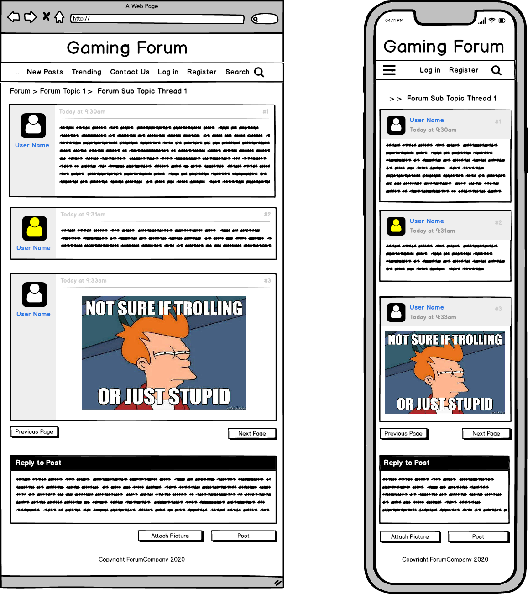

# **MERN-STACK-APP**

ASSESSMENT REQUIREMENTS:

## R1

### ...
*developed by Christopher Morris and Matthew Molloy*

is an online forum where people can discuss, review and post about classic video games. The user is able to create a log in with their email, a password and make a username. From there, the user can create new posts or view and comment on an existing post. The user will also be able to upload images with their posts.

The main target market for ... is gamers, this group is fairly varied and has people from many different backgrounds and lifestyles, but predominantly consisting of males between the ages of 15-35. With this varying userbase we expect the interaction between users to be equally as broad and will be utilising admin roles. Similarly to regular roles, the admin will be able to comment and post, but will also have the ability to delete inappropriate posts and ban users if need be.

## tech stack:

     MERN - MongoDB, ExpressJS, ReactJS, NodeJS

Description of your website, including:
- Purpose
- Functionality / features
- Target audience
- Tech stack	

## Dataflow Diagram:

## Application Architecture Diagram:

## User Stories

## Wireframes for multiple standard screen sizes, created using industry standard software

   

## Screenshots of your Trello board demonstrating use throughout the initial stages of the project